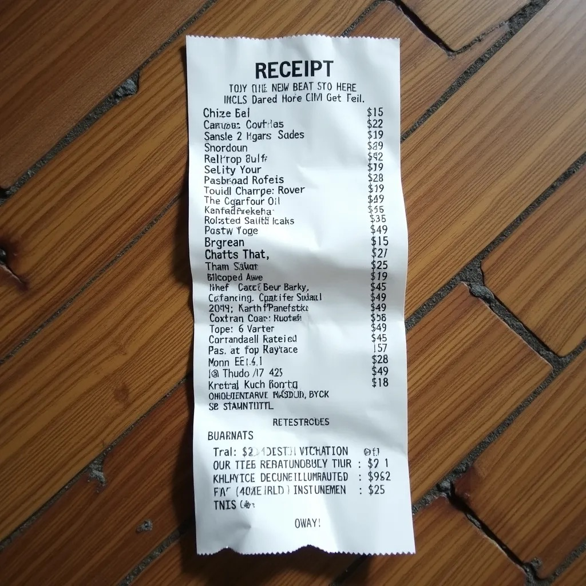
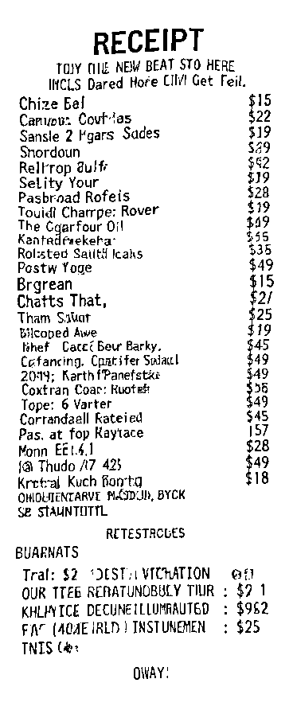
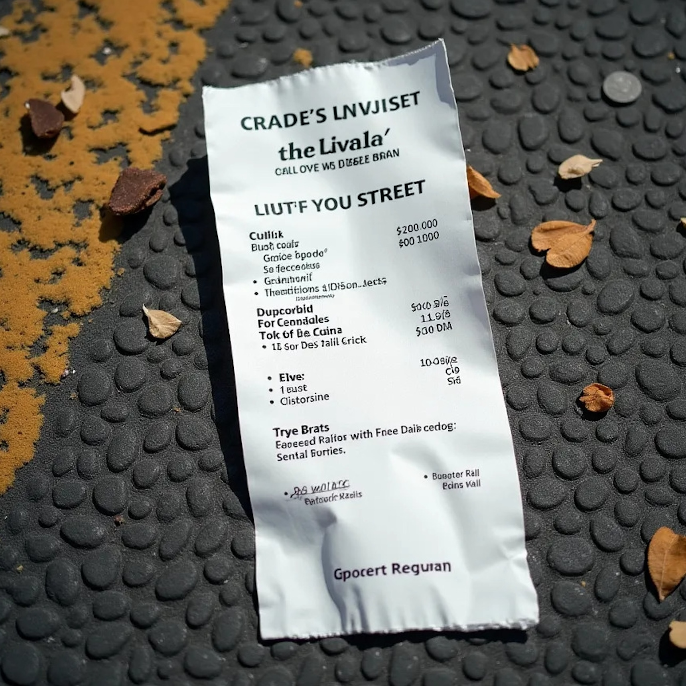
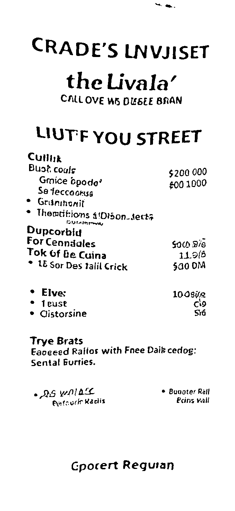
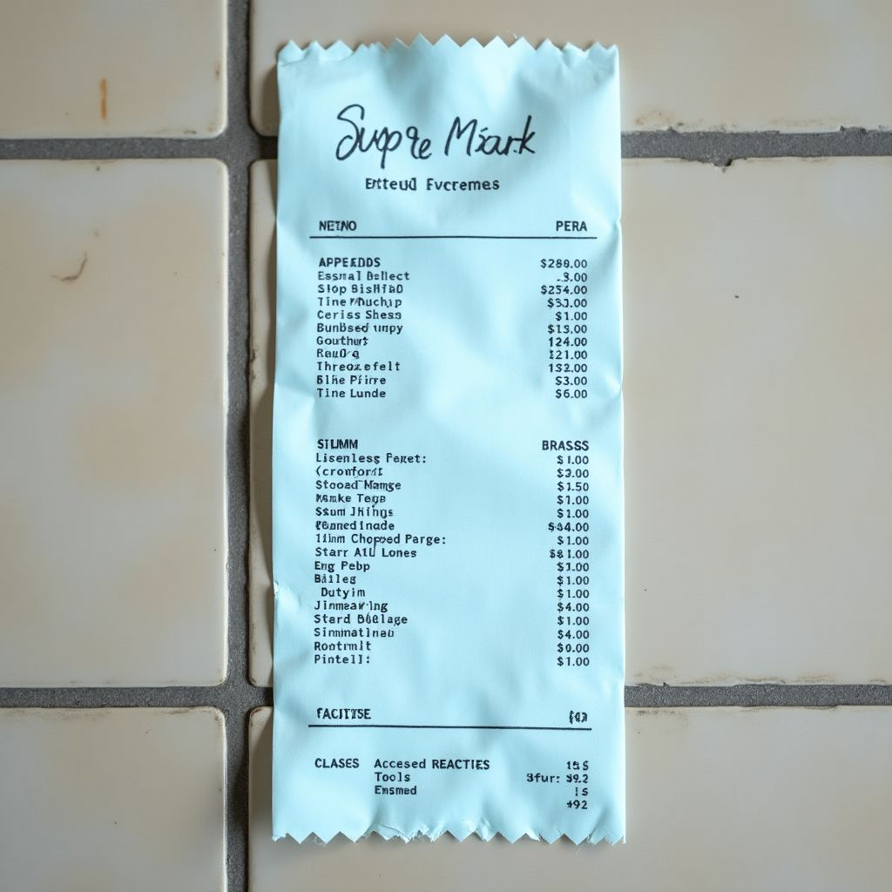
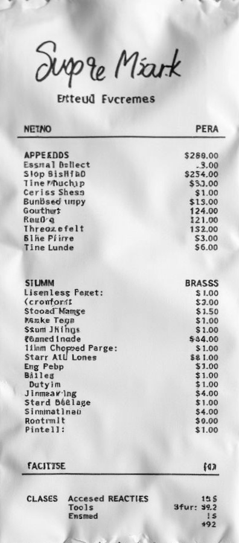

> [!IMPORTANT]
> This project is in maintenance mode.
> Any further development will be carried out in its successor project
> [FlatCV](https://github.com/ad-si/FlatCV).

---

# Perspectra

Software and corresponding workflow to scan documents and books
with as little hardware as possible.

Check out [github:ad-si/awesome-scanning]
for an extensive list of alternative solutions.

[github:ad-si/awesome-scanning]: https://github.com/ad-si/awesome-scanning


Command | Input | Result
--------|-------|-------
`perspectra correct --binary=gauss-diff 01.jpeg`||
`perspectra correct --binary=gauss-diff 02.jpeg`||
`perspectra correct --gray 03.jpeg`||


## Installation

We recommend to use [`uv`](https://docs.astral.sh/uv/)
instead of `pip` to install the package.

```sh
uv tool install perspectra
```

To install from source:

```sh
git clone https://github.com/ad-si/Perspectra
cd Perspectra
make install
```

The `extract-pages` subcommand additionally requires
[`ffmpeg`](https://ffmpeg.org) to be available in your `PATH`
(e.g. via `brew install ffmpeg`).


## Usage

### Command Line Interface

```txt
usage: perspectra [-h] [--debug]
                  {binarize,correct,corners,renumber-pages,extract-pages} ...

options:
  -h, --help            show this help message and exit
  --debug               Render debugging view

subcommands:
  subcommands to handle files and correct photos

  {binarize,correct,corners,renumber-pages,extract-pages}
                        additional help
    binarize            Binarize image
    correct             Pespectively correct and crop photos of documents.
    corners             Returns the corners of the document in the image as
                        [top-left, top-right, bottom-right, bottom-left]
    renumber-pages      Renames the images in a directory according to their
                        page numbers. The assumed layout is `cover -> odd
                        pages -> even pages reversed`
    extract-pages       Extract a photo of each page from a video of a book
                        being flipped through. A page is captured whenever a
                        short clicking sound (e.g. a tongue pop) is made while
                        the page is held in focus.
```


## Best Practices for Taking the Photos

Your photos should ideally have following properties:

- Photos with 10 - 20 Mpx
- Contain 1 document
    - Rectangular
    - Pronounced corners
    - Only black content on white or light-colored paper
    - On dark background
    - Maximum of 30° rotation


### Camera Settings

```yaml
# Rule of thumb is the inverse of your focal length,
# but motion blur is pretty much the worst for readable documents,
# therefore use at least half of it and never less than 1/50.
shutter: 1/50 - 1/200 s

# The whole document must be sharp even if you photograph it from an angle.
# Therefore at least 8 f.
aperture: 8-12 f

# Noise is less bad than motion blur => relative high ISO
# Should be the last thing you set:
# As high as necessary as low as possible
iso: 800-6400
```

When using `Tv` (Time Value) or `Av` (Aperture Value) mode
use exposure compensation to set lightness value below 0.
You really don't want to overexpose your photos as the bright pages
are the first thing that clips.

On the other hand,
it doesn't matter if you loose background parts because they are to dark.


### Generating the Photos from a Video

Film yourself flipping through the book
and make a short clicking sound whenever a page is held still in focus.
A tongue pop works best, as it leaves both hands free
for holding the camera and turning the pages.
The `extract-pages` subcommand then saves the sharpest frame
at each of these moments:

```sh
perspectra extract-pages book.mov --output book_pages
```

The pages are saved as `page-001.png`, `page-002.png`, …
in the `--output` directory
(default: `<video-name>_pages` next to the video).

The rustling of the pages is ignored,
as a click must start abruptly out of relative silence,
decay quickly, and be about as loud as the other clicks.
All levels are measured relative to the background noise,
so this also works in noisy environments.
Use `perspectra --debug extract-pages …` to print the detected sounds
and adjust the thresholds (`--min-contrast`, `--min-decay`, …)
if pages are missed or extracted twice.

Alternatively, you can use [PySceneDetect].
It's a Python/OpenCV-based scene detection program,
using threshold/content analysis on a given video.

[PySceneDetect]: https://github.com/Breakthrough/PySceneDetect

For easy installation you can use the [docker image]

[docker image]: https://github.com/handflucht/PySceneDetect


Find good values for threshold:

```fish
docker run \
  --rm \
  --volume (pwd):/video \
  handflucht/pyscenedetect
  --input /video/page-turning.mp4 \
  --downscale-factor 2 \
  --detector content \
  --statsfile page-turning-stats.csv
```


To launch the image run:

```fish
docker run \
  --interactive \
  --tty \
  --volume=(pwd):/video \
  --entrypoint=bash \
  handflucht/pyscenedetect
```


Then run in the shell:

```bash
cd /video
scenedetect \
  --input page-turning.mp4 \
  --downscale-factor 2 \
  --detector content \
  --threshold 3 \
  --min-scene-length 80 \
  --save-images
```


TODO: The correct way to do this:
(after https://github.com/Breakthrough/PySceneDetect/issues/45 is implemented)

```fish
docker run \
  --rm \
  --volume (pwd):/video \
  handflucht/pyscenedetect \
  --input /video/page-turning.mp4 \
  --downscale-factor 2 \
  --detector content \
  --threshold 3 \
  --min-scene-length 80 \
  --save-images <TODO: path>
```

Aim for a low threshold and a long minimum scene length.
I.e. turn the page really fast and show it for a long time.
